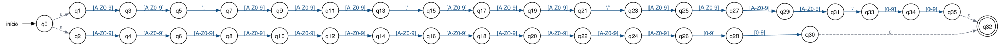
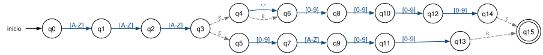
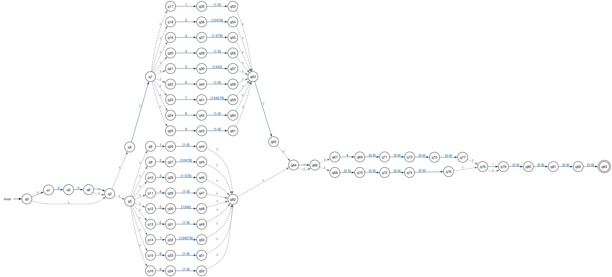
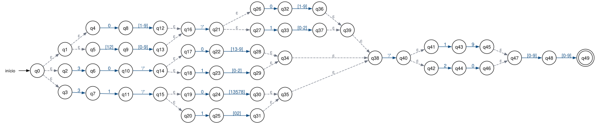
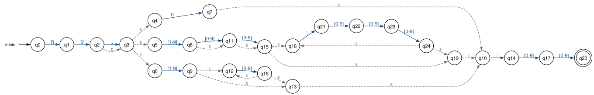

# Expressões Regulares do ValidaFrete

> Documento gerado automaticamente por `scripts/gerar_documentacao.py` a partir de `validafrete/expressoes.py` e `validafrete/casos_teste.py` — os mesmos módulos que o programa executa. Não edite à mão: altere o código e gere de novo.

## Convenções da notação formal

| Notação | Significado |
|---|---|
| `rs` (justaposição) | concatenação |
| `r \| s` | união, L(r) ∪ L(s) |
| `r*` | fecho de Kleene (zero ou mais repetições; inclui ε) |
| `r{m}` | m cópias de r concatenadas |
| `r{m,n}` | união de rᵐ, rᵐ⁺¹, …, rⁿ |
| `ε` | palavra vazia |
| `'.'`, `'/'`, `'-'`, `'('`… | símbolos de pontuação literais (aspas para não confundir com operadores) |
| `␣` | o caractere espaço |
| `D`, `P`, `M`, `A`, `F`, `K` | conjuntos/abreviações definidos no alfabeto de cada ficha |

Todas as ERs são aplicadas com `re.fullmatch`, que exige que a cadeia **inteira** pertença à linguagem (equivale a ancorar o padrão com `^` e `$`). Nenhuma ER usa retroreferências, lookaround, `\d`, `\w`, `\s` ou o ponto curinga.

## Construção dos AFNε

O módulo `validafrete/afn.py` lê o padrão exatamente como está no código, monta a árvore sintática e aplica a construção de Thompson com duas simplificações que preservam a linguagem:

1. **Concatenação `rs`:** o estado final do fragmento de `r` é fundido com o inicial de `s` (em Thompson o estado inicial não tem arestas de entrada e o final não tem arestas de saída, então a fusão não cria caminhos novos).
2. **Opcionalidade `r?` = `(r | ε)`:** um único movimento ε liga o início ao fim do fragmento de `r`, em vez de dois estados extras.

União e fecho de Kleene seguem exatamente o modelo de Thompson. `r{m}` é expandido em m cópias concatenadas e `r{m,n}` em m cópias seguidas de (n − m) cópias opcionais.

Os testes automatizados comparam o AFNε com `re.fullmatch` em todos os casos de teste e em 15.000 cadeias geradas por mutação, garantindo que ambos reconhecem a mesma linguagem.

## Resumo

| ER | Nome | Estados | Transições | Movimentos ε | Testes (aceitas/rejeitadas) |
|---|---|---|---|---|---|
| [ER-01](#er-01) | CNPJ do cliente (alfanumérico ou numérico) | 36 | 36 | 4 | 8 / 8 |
| [ER-02](#er-02) | Placa do veículo (padrão antigo ou Mercosul) | 16 | 17 | 5 | 8 / 8 |
| [ER-03](#er-03) | Telefone do motorista (fixo ou celular, com DDD válido) | 84 | 105 | 48 | 8 / 8 |
| [ER-04](#er-04) | Data da coleta (DD/MM/AAAA com dia compatível com o mês) | 50 | 56 | 26 | 8 / 8 |
| [ER-05](#er-05) | Valor do frete em reais (R$) | 25 | 33 | 17 | 8 / 8 |

---

## ER-01 — CNPJ do cliente (alfanumérico ou numérico)

| Campo | Conteúdo |
|---|---|
| **Identificação** | ER-01 · campo `cnpj` |
| **Finalidade** | Validar o CNPJ da empresa que contrata o frete. Aceita o novo CNPJ alfanumérico (IN RFB nº 2.229/2024, em uso desde julho de 2026) e o formato numérico tradicional, com a máscara XX.XXX.XXX/XXXX-DD ou sem máscara. |
| **Alfabeto (Σ)** | D = {0, 1, 2, 3, 4, 5, 6, 7, 8, 9} (dígitos)<br>M = {A, B, C, …, Z} (26 letras maiúsculas, sem acento)<br>A = M ∪ D (símbolos permitidos na raiz e na ordem do CNPJ)<br>Σ = M ∪ D ∪ {'.', '/', '-'} |
| **Linguagem L** | Cadeias com 14 caracteres significativos: os 12 primeiros pertencem a A (letras maiúsculas ou dígitos) e os 2 últimos, os dígitos verificadores, pertencem a D. A cadeia é escrita sem máscara (14 símbolos seguidos) ou com a máscara completa AA.AAA.AAA/AAAA-DD; máscaras parciais não pertencem a L. |
| **ER formal** | A{2} '.' A{3} '.' A{3} '/' A{4} '-' D{2}  \|  A{12} D{2} |
| **Sintaxe implementada** | `[A-Z0-9]{2}\.[A-Z0-9]{3}\.[A-Z0-9]{3}/[A-Z0-9]{4}-[0-9]{2}\|[A-Z0-9]{12}[0-9]{2}` |

Chamada no código (Python):

```python
re.fullmatch(r"[A-Z0-9]{2}\.[A-Z0-9]{3}\.[A-Z0-9]{3}/[A-Z0-9]{4}-[0-9]{2}|[A-Z0-9]{12}[0-9]{2}", cadeia)
```

### Equivalência entre a sintaxe e os operadores formais

| Na sintaxe do código | Operador formal |
|---|---|
| `[A-Z0-9]` | Classe finita: A = M ∪ D = (A \| B \| … \| Z \| 0 \| 1 \| … \| 9) |
| `[0-9]` | Intervalo finito: D = (0 \| 1 \| … \| 9) |
| `{2}, {3}, {4}, {12}` | Repetição exata: r{m} = r r … r (m cópias concatenadas) |
| `\.` | Ponto literal '.' (o escape remove o significado de "qualquer caractere") |
| `/  e  -` | Símbolos literais '/' e '-' (fora de classes não são operadores) |
| `\|` | União das duas formas: com máscara \| sem máscara |
| `re.fullmatch` | Correspondência completa: equivale a ancorar o padrão no início (^) e no fim ($); a cadeia inteira precisa pertencer a L. |

### AFNε



Gerado a partir do padrão do código pela construção de Thompson ([`er-01-cnpj.dot`](afn/er-01-cnpj.dot), [PNG](afn/er-01-cnpj.png)).

- **Q** = {q0, …, q35} (36 estados)
- **Σ** = {-, ., /, 0, 1, 2, 3, 4, 5, 6, 7, 8, 9, A, B, C, D, E, F, G, H, I, J, K, L, M, N, O, P, Q, R, S, T, U, V, W, X, Y, Z}
- **Estado inicial:** q0
- **Estados finais:** F = {q32}
- **Transições:** 36, das quais 4 são movimentos ε (tracejadas no diagrama)

<details><summary>Tabela de transições δ</summary>

| Origem | Símbolo(s) | Destino |
|---|---|---|
| q0 | ε | q1 |
| q0 | ε | q2 |
| q1 | [A-Z0-9] | q3 |
| q2 | [A-Z0-9] | q4 |
| q3 | [A-Z0-9] | q5 |
| q4 | [A-Z0-9] | q6 |
| q5 | '.' | q7 |
| q6 | [A-Z0-9] | q8 |
| q7 | [A-Z0-9] | q9 |
| q8 | [A-Z0-9] | q10 |
| q9 | [A-Z0-9] | q11 |
| q10 | [A-Z0-9] | q12 |
| q11 | [A-Z0-9] | q13 |
| q12 | [A-Z0-9] | q14 |
| q13 | '.' | q15 |
| q14 | [A-Z0-9] | q16 |
| q15 | [A-Z0-9] | q17 |
| q16 | [A-Z0-9] | q18 |
| q17 | [A-Z0-9] | q19 |
| q18 | [A-Z0-9] | q20 |
| q19 | [A-Z0-9] | q21 |
| q20 | [A-Z0-9] | q22 |
| q21 | '/' | q23 |
| q22 | [A-Z0-9] | q24 |
| q23 | [A-Z0-9] | q25 |
| q24 | [A-Z0-9] | q26 |
| q25 | [A-Z0-9] | q27 |
| q26 | [0-9] | q28 |
| q27 | [A-Z0-9] | q29 |
| q28 | [0-9] | q30 |
| q29 | [A-Z0-9] | q31 |
| q30 | ε | q32 |
| q31 | '-' | q33 |
| q33 | [0-9] | q34 |
| q34 | [0-9] | q35 |
| q35 | ε | q32 |

</details>

### Testes

| # | Cadeia | Esperado | Obtido (re / AFNε) | Descrição |
|---|---|---|---|---|
| 1 | `12.ABC.345/01DE-35` | aceita | aceita / aceita | Alfanumérico com máscara (exemplo oficial da Receita Federal) |
| 2 | `12ABC34501DE35` | aceita | aceita / aceita | Alfanumérico sem máscara |
| 3 | `11.222.333/0001-81` | aceita | aceita / aceita | Numérico tradicional com máscara |
| 4 | `11222333000181` | aceita | aceita / aceita | Numérico tradicional sem máscara |
| 5 | `A1.B2C.3D4/E5F6-07` | aceita | aceita / aceita | Letras e dígitos intercalados |
| 6 | `AB.CDE.FGH/IJKL-12` | aceita | aceita / aceita | Raiz e ordem só com letras, com máscara |
| 7 | `ZZZZZZZZZZZZ99` | aceita | aceita / aceita | Limite: maior símbolo de A em todas as 12 posições **(caso-limite)** |
| 8 | `00.000.000/0000-00` | aceita | aceita / aceita | Limite: formato válido, DV não conferido (falso positivo conhecido) **(caso-limite)** |
| 9 | ε (vazia) | rejeita | rejeita / rejeita | Limite: palavra vazia ε **(caso-limite)** |
| 10 | `12.abc.345/01de-35` | rejeita | rejeita / rejeita | Letras minúsculas não pertencem a Σ |
| 11 | `12.ABC.345/01DE-3A` | rejeita | rejeita / rejeita | Dígito verificador com letra (deve estar em D) |
| 12 | `12ABC345/01DE-35` | rejeita | rejeita / rejeita | Máscara parcial (faltam os pontos) |
| 13 | `12.ABC.345/01DE35` | rejeita | rejeita / rejeita | Máscara sem o hífen |
| 14 | `12ABC34501DE3` | rejeita | rejeita / rejeita | Limite: 13 caracteres (um a menos) **(caso-limite)** |
| 15 | `12ABC34501DE356` | rejeita | rejeita / rejeita | 15 caracteres (um a mais) |
| 16 | `␣11222333000181` | rejeita | rejeita / rejeita | Espaço antes do valor |

### Resultado e limitações

Todos os 16 casos (8 aceitas e 8 rejeitadas) produziram o resultado esperado tanto em `re.fullmatch` quanto na simulação do AFNε.

- Valida apenas o formato: os dígitos verificadores (cálculo módulo 11) não são conferidos. Assim, 00.000.000/0000-00 e 11.222.333/0001-00 são aceitos (falso positivo).
- Letras minúsculas são rejeitadas. O programa não converte a entrada para maiúsculas, para não alterar a linguagem reconhecida.
- Máscaras parciais (ex.: 12ABC345/01DE-35) são rejeitadas por decisão de projeto.

---

## ER-02 — Placa do veículo (padrão antigo ou Mercosul)

| Campo | Conteúdo |
|---|---|
| **Identificação** | ER-02 · campo `placa` |
| **Finalidade** | Validar a placa do caminhão que fará a coleta. Aceita o padrão antigo brasileiro (LLL-NNNN, com hífen opcional) e o padrão Mercosul (LLLNLNN). |
| **Alfabeto (Σ)** | D = {0, 1, 2, 3, 4, 5, 6, 7, 8, 9} (dígitos)<br>M = {A, B, C, …, Z} (26 letras maiúsculas, sem acento)<br>Σ = M ∪ D ∪ {'-'} |
| **Linguagem L** | Três letras maiúsculas seguidas de: (a) quatro dígitos, com ou sem um hífen entre as letras e os dígitos (padrão antigo); ou (b) dígito, letra e dois dígitos, sem hífen (padrão Mercosul). |
| **ER formal** | M{3} ( ('-' \| ε) D{4}  \|  D M D{2} ) |
| **Sintaxe implementada** | `[A-Z]{3}(-?[0-9]{4}\|[0-9][A-Z][0-9]{2})` |

Chamada no código (Python):

```python
re.fullmatch(r"[A-Z]{3}(-?[0-9]{4}|[0-9][A-Z][0-9]{2})", cadeia)
```

### Equivalência entre a sintaxe e os operadores formais

| Na sintaxe do código | Operador formal |
|---|---|
| `[A-Z]` | Intervalo finito: M = (A \| B \| … \| Z) |
| `[0-9]` | Intervalo finito: D = (0 \| 1 \| … \| 9) |
| `{3}, {4}, {2}` | Repetição exata (concatenação de cópias) |
| `-?` | Opcionalidade: ('-' \| ε) |
| `( … \| … )` | Agrupamento da união entre padrão antigo e padrão Mercosul |
| `re.fullmatch` | Correspondência completa: equivale a ancorar o padrão no início (^) e no fim ($); a cadeia inteira precisa pertencer a L. |

### AFNε



Gerado a partir do padrão do código pela construção de Thompson ([`er-02-placa.dot`](afn/er-02-placa.dot), [PNG](afn/er-02-placa.png)).

- **Q** = {q0, …, q15} (16 estados)
- **Σ** = {-, 0, 1, 2, 3, 4, 5, 6, 7, 8, 9, A, B, C, D, E, F, G, H, I, J, K, L, M, N, O, P, Q, R, S, T, U, V, W, X, Y, Z}
- **Estado inicial:** q0
- **Estados finais:** F = {q15}
- **Transições:** 17, das quais 5 são movimentos ε (tracejadas no diagrama)

<details><summary>Tabela de transições δ</summary>

| Origem | Símbolo(s) | Destino |
|---|---|---|
| q0 | [A-Z] | q1 |
| q1 | [A-Z] | q2 |
| q2 | [A-Z] | q3 |
| q3 | ε | q4 |
| q3 | ε | q5 |
| q4 | '-' | q6 |
| q4 | ε | q6 |
| q5 | [0-9] | q7 |
| q6 | [0-9] | q8 |
| q7 | [A-Z] | q9 |
| q8 | [0-9] | q10 |
| q9 | [0-9] | q11 |
| q10 | [0-9] | q12 |
| q11 | [0-9] | q13 |
| q12 | [0-9] | q14 |
| q13 | ε | q15 |
| q14 | ε | q15 |

</details>

### Testes

| # | Cadeia | Esperado | Obtido (re / AFNε) | Descrição |
|---|---|---|---|---|
| 1 | `ABC-1234` | aceita | aceita / aceita | Padrão antigo com hífen |
| 2 | `ABC1234` | aceita | aceita / aceita | Padrão antigo sem hífen |
| 3 | `BRA2E19` | aceita | aceita / aceita | Padrão Mercosul |
| 4 | `RIO2A18` | aceita | aceita / aceita | Padrão Mercosul |
| 5 | `QWE0Z00` | aceita | aceita / aceita | Mercosul com zeros |
| 6 | `MNO-5678` | aceita | aceita / aceita | Padrão antigo com hífen |
| 7 | `AAA-0000` | aceita | aceita / aceita | Limite: menores símbolos em todas as posições **(caso-limite)** |
| 8 | `ZZZ9Z99` | aceita | aceita / aceita | Limite: maiores símbolos em todas as posições (Mercosul) **(caso-limite)** |
| 9 | ε (vazia) | rejeita | rejeita / rejeita | Limite: palavra vazia ε **(caso-limite)** |
| 10 | `abc1d23` | rejeita | rejeita / rejeita | Letras minúsculas |
| 11 | `ABC-1D23` | rejeita | rejeita / rejeita | Mercosul não admite hífen |
| 12 | `AB-1234` | rejeita | rejeita / rejeita | Apenas duas letras |
| 13 | `ABC12345` | rejeita | rejeita / rejeita | Cinco dígitos |
| 14 | `ABC␣1234` | rejeita | rejeita / rejeita | Espaço no lugar do hífen |
| 15 | `ABC1DE3` | rejeita | rejeita / rejeita | Duas letras na parte final |
| 16 | `ABC-123` | rejeita | rejeita / rejeita | Limite: um dígito a menos **(caso-limite)** |

### Resultado e limitações

Todos os 16 casos (8 aceitas e 8 rejeitadas) produziram o resultado esperado tanto em `re.fullmatch` quanto na simulação do AFNε.

- Não consulta se a placa existe ou está registrada; apenas o formato é verificado.
- O padrão Mercosul com hífen (ABC-1D23) é rejeitado, pois a placa oficial não o possui.
- Letras minúsculas e espaços são rejeitados.

---

## ER-03 — Telefone do motorista (fixo ou celular, com DDD válido)

| Campo | Conteúdo |
|---|---|
| **Identificação** | ER-03 · campo `telefone` |
| **Finalidade** | Validar o telefone de contato do motorista. Exige um DDD realmente em uso no Brasil (67 códigos da Anatel), aceita o prefixo +55 e o DDD com ou sem parênteses — sempre balanceados — e distingue celular (9 + 8 dígitos) de fixo (2 a 5 + 7 dígitos). |
| **Alfabeto (Σ)** | D = {0, 1, 2, 3, 4, 5, 6, 7, 8, 9} (dígitos)<br>P = D − {0} = {1, 2, …, 9} (dígitos sem o zero)<br>F = {2, 3, 4, 5} (primeiro dígito de telefone fixo)<br>K = 1P \| 2(1\|2\|4\|7\|8) \| 3(1\|2\|3\|4\|5\|7\|8) \| 4P \| 5(1\|3\|4\|5) \| 6P \| 7(1\|3\|4\|5\|7\|9) \| 8P \| 9P  (os 67 DDDs em uso)<br>Σ = D ∪ {'+', '(', ')', '-', ␣} |
| **Linguagem L** | Números de telefone formados por: prefixo internacional +55 opcional (seguido ou não de espaço); DDD pertencente a K, entre parênteses ou sem eles; espaço opcional; número de celular (9 seguido de 8 dígitos) ou fixo (dígito de 2 a 5 seguido de 7 dígitos), com hífen opcional antes dos 4 últimos dígitos. |
| **ER formal** | ( '+' 55 (␣ \| ε) \| ε ) ( '(' K ')' \| K ) (␣ \| ε) ( 9 D{4} \| F D{3} ) ('-' \| ε) D{4} |
| **Sintaxe implementada** | `(\+55 ?)?(\((1[1-9]\|2[12478]\|3[1-578]\|4[1-9]\|5[1345]\|6[1-9]\|7[134579]\|8[1-9]\|9[1-9])\)\|(1[1-9]\|2[12478]\|3[1-578]\|4[1-9]\|5[1345]\|6[1-9]\|7[134579]\|8[1-9]\|9[1-9])) ?(9[0-9]{4}\|[2-5][0-9]{3})-?[0-9]{4}` |

Chamada no código (Python):

```python
re.fullmatch(r"(\+55 ?)?(\((1[1-9]|2[12478]|3[1-578]|4[1-9]|5[1345]|6[1-9]|7[134579]|8[1-9]|9[1-9])\)|(1[1-9]|2[12478]|3[1-578]|4[1-9]|5[1345]|6[1-9]|7[134579]|8[1-9]|9[1-9])) ?(9[0-9]{4}|[2-5][0-9]{3})-?[0-9]{4}", cadeia)
```

### Equivalência entre a sintaxe e os operadores formais

| Na sintaxe do código | Operador formal |
|---|---|
| `\+  \(  \)` | Símbolos literais '+', '(' e ')' (escapados porque são operadores) |
| `(\+55 ?)?` | Opcionalidade aninhada: ('+' 5 5 (␣ \| ε) \| ε) |
| `[1-9]` | Intervalo: P = (1 \| 2 \| … \| 9) |
| `[12478], [1-578], [1345], [134579]` | Classes finitas: (1\|2\|4\|7\|8), (1\|2\|3\|4\|5\|7\|8), ... |
| `1[1-9]\|2[12478]\|…\|9[1-9]` | União dos 67 DDDs válidos (abreviada por K na forma formal) |
| `\(K\)\|K` | União que só aceita parênteses balanceados: o K aparece duas vezes, porque uma ER não tem memória para "lembrar" que abriu um parêntese |
| `[2-5]` | Intervalo: F = (2 \| 3 \| 4 \| 5) |
| ` ?  e  -?` | Opcionalidade: (␣ \| ε) e ('-' \| ε) |
| `re.fullmatch` | Correspondência completa: equivale a ancorar o padrão no início (^) e no fim ($); a cadeia inteira precisa pertencer a L. |

### AFNε



Gerado a partir do padrão do código pela construção de Thompson ([`er-03-telefone.dot`](afn/er-03-telefone.dot), [PNG](afn/er-03-telefone.png)).

- **Q** = {q0, …, q83} (84 estados)
- **Σ** = {(, ), +, -, 0, 1, 2, 3, 4, 5, 6, 7, 8, 9, ␣}
- **Estado inicial:** q0
- **Estados finais:** F = {q83}
- **Transições:** 105, das quais 48 são movimentos ε (tracejadas no diagrama)

<details><summary>Tabela de transições δ</summary>

| Origem | Símbolo(s) | Destino |
|---|---|---|
| q0 | '+' | q1 |
| q0 | ε | q2 |
| q1 | 5 | q3 |
| q2 | ε | q4 |
| q2 | ε | q5 |
| q3 | 5 | q6 |
| q4 | '(' | q7 |
| q5 | ε | q8 |
| q5 | ε | q9 |
| q5 | ε | q10 |
| q5 | ε | q11 |
| q5 | ε | q12 |
| q5 | ε | q13 |
| q5 | ε | q14 |
| q5 | ε | q15 |
| q5 | ε | q16 |
| q6 | ␣ | q2 |
| q6 | ε | q2 |
| q7 | ε | q17 |
| q7 | ε | q18 |
| q7 | ε | q19 |
| q7 | ε | q20 |
| q7 | ε | q21 |
| q7 | ε | q22 |
| q7 | ε | q23 |
| q7 | ε | q24 |
| q7 | ε | q25 |
| q8 | 1 | q26 |
| q9 | 2 | q27 |
| q10 | 3 | q28 |
| q11 | 4 | q29 |
| q12 | 5 | q30 |
| q13 | 6 | q31 |
| q14 | 7 | q32 |
| q15 | 8 | q33 |
| q16 | 9 | q34 |
| q17 | 1 | q35 |
| q18 | 2 | q36 |
| q19 | 3 | q37 |
| q20 | 4 | q38 |
| q21 | 5 | q39 |
| q22 | 6 | q40 |
| q23 | 7 | q41 |
| q24 | 8 | q42 |
| q25 | 9 | q43 |
| q26 | [1-9] | q44 |
| q27 | [12478] | q45 |
| q28 | [1-578] | q46 |
| q29 | [1-9] | q47 |
| q30 | [1345] | q48 |
| q31 | [1-9] | q49 |
| q32 | [134579] | q50 |
| q33 | [1-9] | q51 |
| q34 | [1-9] | q52 |
| q35 | [1-9] | q53 |
| q36 | [12478] | q54 |
| q37 | [1-578] | q55 |
| q38 | [1-9] | q56 |
| q39 | [1345] | q57 |
| q40 | [1-9] | q58 |
| q41 | [134579] | q59 |
| q42 | [1-9] | q60 |
| q43 | [1-9] | q61 |
| q44 | ε | q62 |
| q45 | ε | q62 |
| q46 | ε | q62 |
| q47 | ε | q62 |
| q48 | ε | q62 |
| q49 | ε | q62 |
| q50 | ε | q62 |
| q51 | ε | q62 |
| q52 | ε | q62 |
| q53 | ε | q63 |
| q54 | ε | q63 |
| q55 | ε | q63 |
| q56 | ε | q63 |
| q57 | ε | q63 |
| q58 | ε | q63 |
| q59 | ε | q63 |
| q60 | ε | q63 |
| q61 | ε | q63 |
| q62 | ε | q64 |
| q63 | ')' | q65 |
| q64 | ␣ | q66 |
| q64 | ε | q66 |
| q65 | ε | q64 |
| q66 | ε | q67 |
| q66 | ε | q68 |
| q67 | 9 | q69 |
| q68 | [2-5] | q70 |
| q69 | [0-9] | q71 |
| q70 | [0-9] | q72 |
| q71 | [0-9] | q73 |
| q72 | [0-9] | q74 |
| q73 | [0-9] | q75 |
| q74 | [0-9] | q76 |
| q75 | [0-9] | q77 |
| q76 | ε | q78 |
| q77 | ε | q78 |
| q78 | '-' | q79 |
| q78 | ε | q79 |
| q79 | [0-9] | q80 |
| q80 | [0-9] | q81 |
| q81 | [0-9] | q82 |
| q82 | [0-9] | q83 |

</details>

### Testes

| # | Cadeia | Esperado | Obtido (re / AFNε) | Descrição |
|---|---|---|---|---|
| 1 | `+55␣(11)␣91234-5678` | aceita | aceita / aceita | Celular completo com DDI, DDD entre parênteses e hífen |
| 2 | `(21)␣3456-7890` | aceita | aceita / aceita | Fixo com DDD entre parênteses |
| 3 | `11912345678` | aceita | aceita / aceita | Celular apenas com dígitos |
| 4 | `+5561987654321` | aceita | aceita / aceita | DDI e DDD sem separadores |
| 5 | `(47)98888-0000` | aceita | aceita / aceita | Sem espaço após o DDD |
| 6 | `85␣3222-1100` | aceita | aceita / aceita | Fixo com DDD sem parênteses |
| 7 | `+55␣31␣2345-6789` | aceita | aceita / aceita | DDI com DDD sem parênteses |
| 8 | `(99)␣90000-0000` | aceita | aceita / aceita | Limite: maior DDD existente **(caso-limite)** |
| 9 | ε (vazia) | rejeita | rejeita / rejeita | Limite: palavra vazia ε **(caso-limite)** |
| 10 | `(11␣91234-5678` | rejeita | rejeita / rejeita | Parênteses desbalanceados |
| 11 | `(23)␣91234-5678` | rejeita | rejeita / rejeita | DDD 23 não existe |
| 12 | `11␣81234-5678` | rejeita | rejeita / rejeita | Nove dígitos sem começar por 9 |
| 13 | `11␣6123-4567` | rejeita | rejeita / rejeita | Fixo começando por 6 |
| 14 | `+55␣␣11␣91234-5678` | rejeita | rejeita / rejeita | Dois espaços seguidos |
| 15 | `11␣91234-567` | rejeita | rejeita / rejeita | Limite: um dígito a menos **(caso-limite)** |
| 16 | `+1␣(11)␣91234-5678` | rejeita | rejeita / rejeita | DDI diferente de +55 |

### Resultado e limitações

Todos os 16 casos (8 aceitas e 8 rejeitadas) produziram o resultado esperado tanto em `re.fullmatch` quanto na simulação do AFNε.

- Não verifica se o número está ativo nem se o prefixo pertence a uma operadora.
- Aceita separadores em posições alternativas, como +5511912345678 ou (11)91234-5678, mas rejeita espaços duplos e hífens fora do lugar.
- Números 0800, 0300 e de serviços (190, 192) não pertencem à linguagem.

---

## ER-04 — Data da coleta (DD/MM/AAAA com dia compatível com o mês)

| Campo | Conteúdo |
|---|---|
| **Identificação** | ER-04 · campo `data` |
| **Finalidade** | Validar a data agendada para a coleta. Além do formato, impede dias inexistentes como 31/04 ou 30/02, e restringe o ano ao intervalo 1900–2099. |
| **Alfabeto (Σ)** | D = {0, 1, 2, 3, 4, 5, 6, 7, 8, 9} (dígitos)<br>P = D − {0} = {1, 2, …, 9} (dígitos sem o zero)<br>Σ = D ∪ {'/'} |
| **Linguagem L** | Datas DD/MM/AAAA com ano entre 1900 e 2099 em que: os dias 01 a 29 ocorrem em qualquer mês; o dia 30 ocorre em todos os meses exceto fevereiro; e o dia 31 ocorre apenas em janeiro, março, maio, julho, agosto, outubro e dezembro. |
| **ER formal** | ( (0P \| (1\|2)D) '/' (0P \| 1(0\|1\|2))  \|  30 '/' (0(1\|3\|4\|5\|6\|7\|8\|9) \| 1(0\|1\|2))  \|  31 '/' (0(1\|3\|5\|7\|8) \| 1(0\|2)) ) '/' (19 \| 20) D{2} |
| **Sintaxe implementada** | `((0[1-9]\|[12][0-9])/(0[1-9]\|1[0-2])\|30/(0[13-9]\|1[0-2])\|31/(0[13578]\|1[02]))/(19\|20)[0-9]{2}` |

Chamada no código (Python):

```python
re.fullmatch(r"((0[1-9]|[12][0-9])/(0[1-9]|1[0-2])|30/(0[13-9]|1[0-2])|31/(0[13578]|1[02]))/(19|20)[0-9]{2}", cadeia)
```

### Equivalência entre a sintaxe e os operadores formais

| Na sintaxe do código | Operador formal |
|---|---|
| `0[1-9]\|[12][0-9]` | Dias 01–29: (0P \| (1\|2)D) |
| `0[1-9]\|1[0-2]` | Meses 01–12: (0P \| 1(0\|1\|2)) |
| `[13-9]` | Classe com intervalo: (1 \| 3 \| 4 \| 5 \| 6 \| 7 \| 8 \| 9), ou seja, sem o 2 (fevereiro) |
| `[13578], [02]` | Classes finitas dos meses com 31 dias: (1\|3\|5\|7\|8) e (0\|2) |
| `19\|20` | União das duas possibilidades de século |
| `[0-9]{2}` | Repetição exata: D D |
| `re.fullmatch` | Correspondência completa: equivale a ancorar o padrão no início (^) e no fim ($); a cadeia inteira precisa pertencer a L. |

### AFNε



Gerado a partir do padrão do código pela construção de Thompson ([`er-04-data.dot`](afn/er-04-data.dot), [PNG](afn/er-04-data.png)).

- **Q** = {q0, …, q49} (50 estados)
- **Σ** = {/, 0, 1, 2, 3, 4, 5, 6, 7, 8, 9}
- **Estado inicial:** q0
- **Estados finais:** F = {q49}
- **Transições:** 56, das quais 26 são movimentos ε (tracejadas no diagrama)

<details><summary>Tabela de transições δ</summary>

| Origem | Símbolo(s) | Destino |
|---|---|---|
| q0 | ε | q1 |
| q0 | ε | q2 |
| q0 | ε | q3 |
| q1 | ε | q4 |
| q1 | ε | q5 |
| q2 | 3 | q6 |
| q3 | 3 | q7 |
| q4 | 0 | q8 |
| q5 | [12] | q9 |
| q6 | 0 | q10 |
| q7 | 1 | q11 |
| q8 | [1-9] | q12 |
| q9 | [0-9] | q13 |
| q10 | '/' | q14 |
| q11 | '/' | q15 |
| q12 | ε | q16 |
| q13 | ε | q16 |
| q14 | ε | q17 |
| q14 | ε | q18 |
| q15 | ε | q19 |
| q15 | ε | q20 |
| q16 | '/' | q21 |
| q17 | 0 | q22 |
| q18 | 1 | q23 |
| q19 | 0 | q24 |
| q20 | 1 | q25 |
| q21 | ε | q26 |
| q21 | ε | q27 |
| q22 | [13-9] | q28 |
| q23 | [0-2] | q29 |
| q24 | [13578] | q30 |
| q25 | [02] | q31 |
| q26 | 0 | q32 |
| q27 | 1 | q33 |
| q28 | ε | q34 |
| q29 | ε | q34 |
| q30 | ε | q35 |
| q31 | ε | q35 |
| q32 | [1-9] | q36 |
| q33 | [0-2] | q37 |
| q34 | ε | q38 |
| q35 | ε | q38 |
| q36 | ε | q39 |
| q37 | ε | q39 |
| q38 | '/' | q40 |
| q39 | ε | q38 |
| q40 | ε | q41 |
| q40 | ε | q42 |
| q41 | 1 | q43 |
| q42 | 2 | q44 |
| q43 | 9 | q45 |
| q44 | 0 | q46 |
| q45 | ε | q47 |
| q46 | ε | q47 |
| q47 | [0-9] | q48 |
| q48 | [0-9] | q49 |

</details>

### Testes

| # | Cadeia | Esperado | Obtido (re / AFNε) | Descrição |
|---|---|---|---|---|
| 1 | `01/01/2000` | aceita | aceita / aceita | Primeiro dia do ano |
| 2 | `15/08/2025` | aceita | aceita / aceita | Data comum |
| 3 | `29/02/2024` | aceita | aceita / aceita | 29 de fevereiro em ano bissexto |
| 4 | `30/04/2026` | aceita | aceita / aceita | Dia 30 em mês de 30 dias |
| 5 | `31/12/1999` | aceita | aceita / aceita | Dia 31 em mês de 31 dias |
| 6 | `31/01/1900` | aceita | aceita / aceita | Limite: menor ano aceito **(caso-limite)** |
| 7 | `28/02/2099` | aceita | aceita / aceita | Limite: maior ano aceito **(caso-limite)** |
| 8 | `29/02/2023` | aceita | aceita / aceita | Limite: aceito pela linguagem, embora 2023 não seja bissexto **(caso-limite)** |
| 9 | ε (vazia) | rejeita | rejeita / rejeita | Limite: palavra vazia ε **(caso-limite)** |
| 10 | `31/04/2025` | rejeita | rejeita / rejeita | Abril não tem dia 31 |
| 11 | `30/02/2024` | rejeita | rejeita / rejeita | Fevereiro não tem dia 30 |
| 12 | `00/10/2020` | rejeita | rejeita / rejeita | Dia zero |
| 13 | `15/13/2020` | rejeita | rejeita / rejeita | Mês 13 |
| 14 | `1/1/2020` | rejeita | rejeita / rejeita | Dia e mês sem zero à esquerda |
| 15 | `15/08/2100` | rejeita | rejeita / rejeita | Limite: ano acima de 2099 **(caso-limite)** |
| 16 | `15-08-2020` | rejeita | rejeita / rejeita | Separador '-' em vez de '/' |

### Resultado e limitações

Todos os 16 casos (8 aceitas e 8 rejeitadas) produziram o resultado esperado tanto em `re.fullmatch` quanto na simulação do AFNε.

- 29/02 é aceito em qualquer ano (ex.: 29/02/2023, falso positivo). Como o intervalo de anos é finito, os bissextos até poderiam ser descritos por uma ER, mas ela ficaria enorme e ilegível; essa verificação fica para uma etapa posterior.
- Não verifica se a data é passada ou futura, nem aceita formatos como D/M/AAAA ou AAAA-MM-DD.

---

## ER-05 — Valor do frete em reais (R$)

| Campo | Conteúdo |
|---|---|
| **Identificação** | ER-05 · campo `valor` |
| **Finalidade** | Validar o valor cobrado pelo frete no padrão monetário brasileiro: prefixo R$, parte inteira sem zeros à esquerda, separador de milhar opcional (mas consistente) e exatamente dois centavos após a vírgula. |
| **Alfabeto (Σ)** | D = {0, 1, 2, 3, 4, 5, 6, 7, 8, 9} (dígitos)<br>P = D − {0} = {1, 2, …, 9} (dígitos sem o zero)<br>Σ = D ∪ {R, '$', ␣, '.', ','} |
| **Linguagem L** | Cadeias iniciadas por R$, com espaço opcional, seguidas da parte inteira — 0, ou um número sem zero à esquerda escrito inteiramente com separadores de milhar '.' em grupos de três dígitos, ou inteiramente sem separadores — e, por fim, vírgula e dois dígitos de centavos. |
| **ER formal** | R '$' (␣ \| ε) ( 0  \|  P D{0,2} ('.' D{3})*  \|  P D* ) ',' D{2} |
| **Sintaxe implementada** | `R\$ ?(0\|[1-9][0-9]{0,2}(\.[0-9]{3})*\|[1-9][0-9]*),[0-9]{2}` |

Chamada no código (Python):

```python
re.fullmatch(r"R\$ ?(0|[1-9][0-9]{0,2}(\.[0-9]{3})*|[1-9][0-9]*),[0-9]{2}", cadeia)
```

### Equivalência entre a sintaxe e os operadores formais

| Na sintaxe do código | Operador formal |
|---|---|
| `R\$` | Símbolos literais R e '$' ($ é escapado porque é âncora de fim no motor) |
| ` ?` | Opcionalidade do espaço: (␣ \| ε) |
| `[1-9][0-9]{0,2}` | Repetição limitada: P D{0,2} = P (ε \| D \| DD) |
| `(\.[0-9]{3})*` | Fecho de Kleene: zero ou mais grupos de milhar '.' D D D |
| `[1-9][0-9]*` | Fecho de Kleene: P D* (inteiro sem separadores) |
| `,[0-9]{2}` | Vírgula literal seguida de exatamente dois dígitos |
| `re.fullmatch` | Correspondência completa: equivale a ancorar o padrão no início (^) e no fim ($); a cadeia inteira precisa pertencer a L. |

### AFNε



Gerado a partir do padrão do código pela construção de Thompson ([`er-05-valor.dot`](afn/er-05-valor.dot), [PNG](afn/er-05-valor.png)).

- **Q** = {q0, …, q24} (25 estados)
- **Σ** = {$, ,, ., 0, 1, 2, 3, 4, 5, 6, 7, 8, 9, R, ␣}
- **Estado inicial:** q0
- **Estados finais:** F = {q20}
- **Transições:** 33, das quais 17 são movimentos ε (tracejadas no diagrama)

<details><summary>Tabela de transições δ</summary>

| Origem | Símbolo(s) | Destino |
|---|---|---|
| q0 | R | q1 |
| q1 | '$' | q2 |
| q2 | ␣ | q3 |
| q2 | ε | q3 |
| q3 | ε | q4 |
| q3 | ε | q5 |
| q3 | ε | q6 |
| q4 | 0 | q7 |
| q5 | [1-9] | q8 |
| q6 | [1-9] | q9 |
| q7 | ε | q10 |
| q8 | [0-9] | q11 |
| q8 | ε | q11 |
| q9 | ε | q12 |
| q9 | ε | q13 |
| q10 | ',' | q14 |
| q11 | [0-9] | q15 |
| q11 | ε | q15 |
| q12 | [0-9] | q16 |
| q13 | ε | q10 |
| q14 | [0-9] | q17 |
| q15 | ε | q18 |
| q15 | ε | q19 |
| q16 | ε | q12 |
| q16 | ε | q13 |
| q17 | [0-9] | q20 |
| q18 | '.' | q21 |
| q19 | ε | q10 |
| q21 | [0-9] | q22 |
| q22 | [0-9] | q23 |
| q23 | [0-9] | q24 |
| q24 | ε | q18 |
| q24 | ε | q19 |

</details>

### Testes

| # | Cadeia | Esperado | Obtido (re / AFNε) | Descrição |
|---|---|---|---|---|
| 1 | `R$␣1.234,56` | aceita | aceita / aceita | Com separador de milhar |
| 2 | `R$1500,00` | aceita | aceita / aceita | Sem espaço e sem separador |
| 3 | `R$␣0,99` | aceita | aceita / aceita | Parte inteira zero |
| 4 | `R$␣12.345.678,90` | aceita | aceita / aceita | Vários grupos de milhar |
| 5 | `R$␣1000000,00` | aceita | aceita / aceita | Inteiro grande sem separador |
| 6 | `R$␣7,00` | aceita | aceita / aceita | Um único dígito inteiro |
| 7 | `R$␣0,00` | aceita | aceita / aceita | Limite: menor valor **(caso-limite)** |
| 8 | `R$␣999,99` | aceita | aceita / aceita | Limite: maior valor sem grupo de milhar **(caso-limite)** |
| 9 | ε (vazia) | rejeita | rejeita / rejeita | Limite: palavra vazia ε **(caso-limite)** |
| 10 | `R$␣01,50` | rejeita | rejeita / rejeita | Zero à esquerda |
| 11 | `R$␣1.23,45` | rejeita | rejeita / rejeita | Grupo de milhar com dois dígitos |
| 12 | `R$␣1234.567,00` | rejeita | rejeita / rejeita | Mistura de formatos (com e sem separador) |
| 13 | `R$␣10,5` | rejeita | rejeita / rejeita | Limite: só um dígito de centavos **(caso-limite)** |
| 14 | `1.234,56` | rejeita | rejeita / rejeita | Sem o prefixo R$ |
| 15 | `R$␣1,234.56` | rejeita | rejeita / rejeita | Formato americano |
| 16 | `R$␣-10,00` | rejeita | rejeita / rejeita | Valor negativo |

### Resultado e limitações

Todos os 16 casos (8 aceitas e 8 rejeitadas) produziram o resultado esperado tanto em `re.fullmatch` quanto na simulação do AFNε.

- Não há valor máximo: qualquer quantidade de grupos de milhar é aceita.
- R$ 0,00 é aceito (frete cortesia); valores negativos e o formato americano (R$ 1,234.56) são rejeitados.
- Não aceita o símbolo sem o prefixo (1.234,56) nem 'R $' com espaço entre R e $.

---
